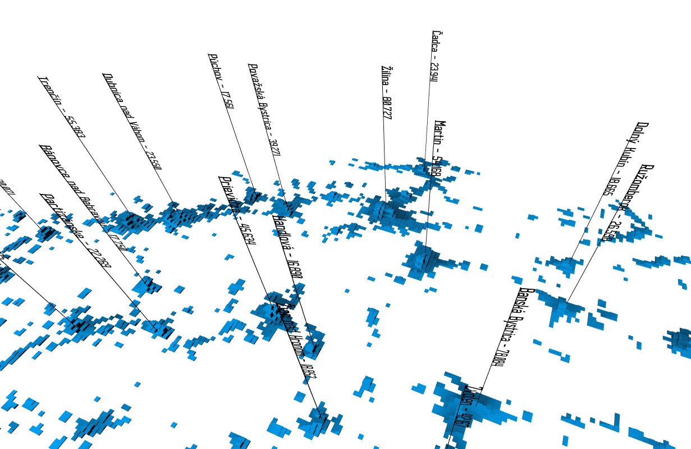

# 3d-map-slovakia-population

This 3d map visualizes the population density in Slovakia.

Data were taken from:

- [municipalities-slovakia dataset](https://github.com/adammertel/municipalities-slovakia)
- [worldpop dataset on population density](www.worldpop.org) dataset reprojected in QGIS and parsed with [geotiff](https://geotiffjs.github.io/)

Created with react-three-fiber.
